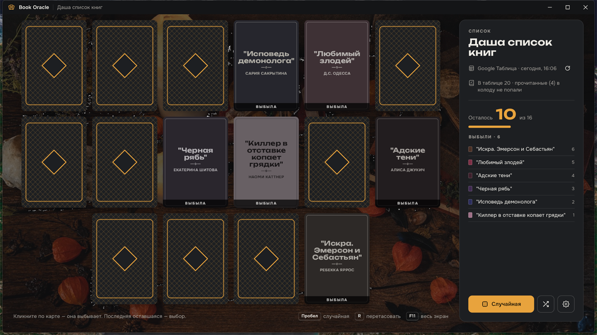
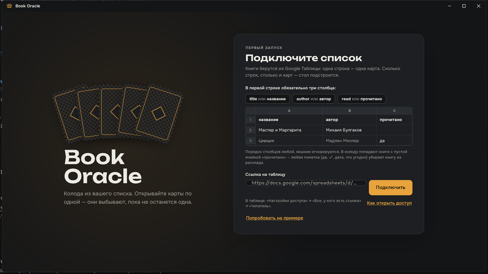
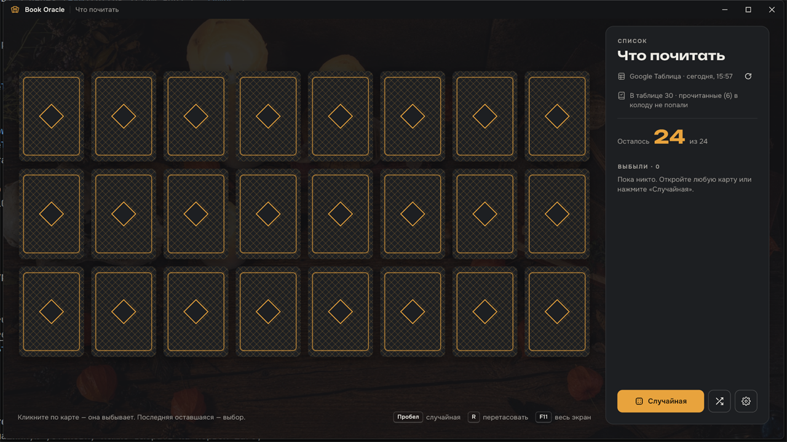
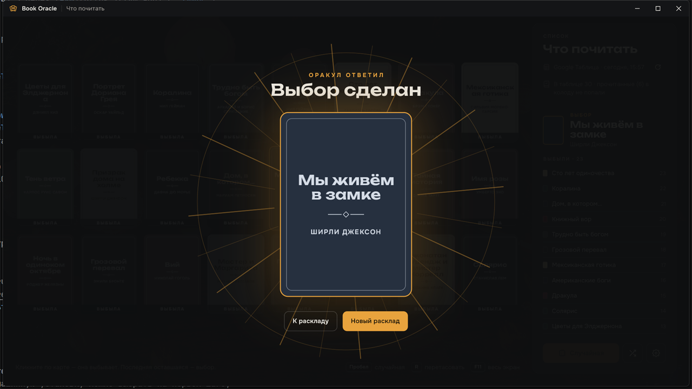
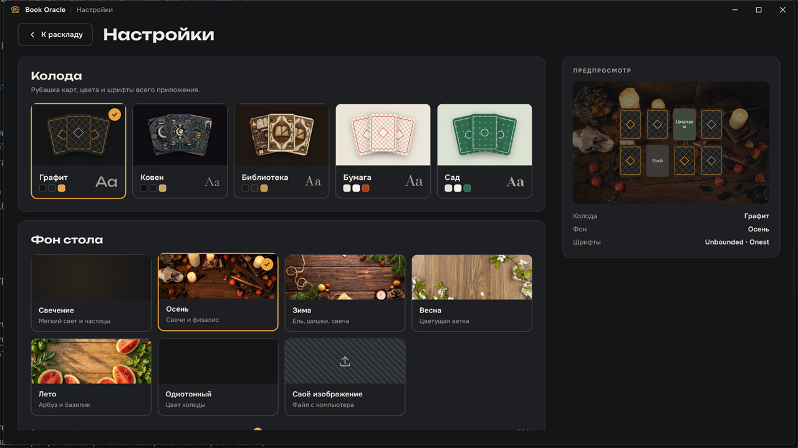

# Book Oracle

**Что почитать следующим — решает колода.**

Приложение для Windows: берёт непрочитанные книги из вашей Google Таблицы и
раскладывает их рубашкой вверх. Вы открываете карты по одной — открытая
**выбывает**. Последняя оставшаяся и есть ответ.

---

## Зачем

Список «почитать» растёт быстрее, чем вы читаете. Выбрать из тридцати книг
сложнее, чем из двух, — и дело кончается тем, что не читаешь ничего.

Book Oracle убирает выбор. Вы не решаете, что взять, — вы по очереди
отказываетесь от того, что не жалко. Когда остаётся одна карта, решение уже
принято, и спорить не с чем.

Никаких «книг месяца», периодов и статистики. Один вопрос, один ответ.

## Как это работает

**1. Подключите список.** Одна строка таблицы — одна карта. Нужны три
столбца: название, автор и «прочитано». Порядок любой, лишние столбцы
игнорируются.

**2. Откройте карты.** Открытая карта выбывает — сереет, получает плашку
«Выбыла» и уходит в журнал справа. Стол сам подстраивается под размер колоды и
окна: от двух карт до шестидесяти. `Пробел` откроет случайную, если решать не
хочется совсем.

**3. Получите ответ.** Когда остаётся одна карта, она разворачивается на весь
экран.

## Возможности

- **Пять колод** — «Графит», «Ковен», «Библиотека», «Бумага», «Сад». Каждая
  меняет не только рубашку, но цвета и шрифты всего приложения, светлые темы
  в том числе.
- **Семь фонов стола** — живое свечение с частицами, четыре сезонных фото,
  однотонный и своё изображение. Сезонный может переключаться сам по дате.
- **Работает без интернета** — последний список сохраняется локально. Нет
  сети — приложение открывает сохранённую копию, показывает чип «Офлайн» и
  само проверяет связь раз в минуту.
- **Стол под любое окно** — от 1280×720 до 4K. Сетка пересчитывается под
  количество карт и предпочитает ровный прямоугольник рваному последнему ряду.
- **Клавиатура** — `Пробел` случайная, `R` перетасовать, `F11` весь экран,
  `Tab` и `Enter` по картам.
- **Русский и английский** — переключается в настройках.

## Установка

Скачайте `BookOracleSetup-<версия>.exe` и запустите.

Ставится в профиль пользователя, **без прав администратора**. Создаёт ярлык в
меню «Пуск», при удалении спрашивает, стирать ли настройки. Всё необходимое
уже внутри — ни Visual C++ Redistributable, ни чего-либо ещё доустанавливать
не нужно.

Нужна Windows 10 или новее, 64-разрядная.

Собрать инсталлятор самому: [DEVELOPMENT.md](docs/DEVELOPMENT.md#инсталлятор).

## Таблица

Google Таблица должна быть открыта по ссылке на чтение:
**Настройки доступа → Все, у кого есть ссылка → Читатель**. В первую строку —
заголовки:

| название | автор | прочитано |
|---|---|---|
| Мастер и Маргарита | Михаил Булгаков | |
| Цирцея | Мадлен Миллер | да |
| Ночной цирк | Эрин Моргенштерн | |

Заголовки можно писать и по-английски: `title`, `author`, `read`.

Столбец «прочитано» работает как галочка: **пустая ячейка — книга в колоде,
любая пометка — нет**. Подойдёт что угодно — `да`, `✓`, дата, оценка, заметка.
Обратная сторона: `нет` и `0` тоже считаются пометкой.

Приложение ничего не записывает в таблицу и не просит доступ к аккаунту
Google — только читает CSV-экспорт по ссылке.

Если ссылки под рукой нет, на первом экране есть «Попробовать на примере» —
встроенный список из тридцати книг, чтобы посмотреть, как это работает.

## Что дальше

Ещё не сделано и, возможно, стоит: отметка «прочитано» прямо из приложения,
история прошлых выборов, звуки карт (заготовка есть, но звучит плохо —
подробности в [DEVELOPMENT.md](docs/DEVELOPMENT.md#звуки-карт)).

---

[Разработка](docs/DEVELOPMENT.md) · [Техническое задание](docs/SPEC.md) ·
[Токены дизайна](assets/design_tokens.json)

Шрифты — Unbounded, Onest, Cormorant Garamond, Manrope, Old Standard TT,
Prata, Yeseva One — под лицензией OFL.

